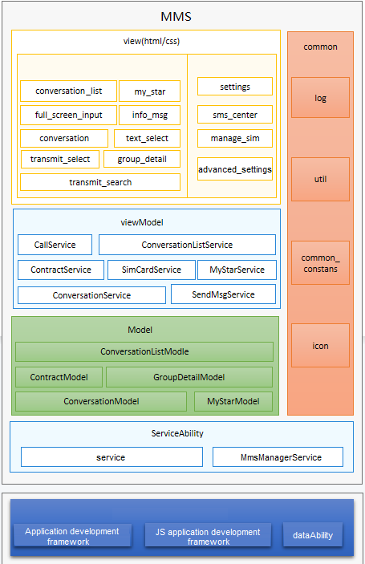

# MMS<a name="EN-US_TOPIC_0000001103421572"></a>

-   [Introduction](#section11660541593)
    -   [Architecture](#section48896451454)

-   [Directory Structure](#section161941989596)
-   [Usage](#section123459000)
-   [Repositories Involved](#section1371113476307)

## Introduction<a name="section11660541593"></a>

The MMS application is pre-installed in OpenHarmony and provides functions such as sending, receiving, forwarding, favoriting, locking, and resending of SMS and MMS messages.


### Architecture<a name="section48896451454"></a>



## Directory Structure<a name="section161941989596"></a>

```
/applications/standard/mms
├── figures                             		# Architecture diagram
├── entry                               		# Main entry module
│    ├── src		
│      ├── main		
│        └── js                         		# JS code
│          └── default		
│            └── common.icon            		# Icon
│              └── i18n                 		# Internationalization
│			   └── model                		# Data management layer
│			   └── pages                		# Pages
│                └── advanced_settings  		# Advanced settings page
│                └── component          		# Components
│				 └── conversation       		# Conversation page
│				 └── conversation_list  		# Conversation list page
│				 └── full_screen_input  		# Full-screen input page
│				 └── full_srceen_show_picture  	# Full-screen image display page
│				 └── group_detail              	# Group details page
│				 └── info_msg                  	# Notification message list page
│				 └── index                     	# Homepage
│				 └── manage_sim                	# SIM card management page
│				 └── my_star                   	# Favorites page
│				 └── query_report               # Query report page
│				 └── settings                  	# Settings page
│                └── sms_center 	           	# SMSC page
│				 └── text_select               	# Text selection page
│				 └── transmit_select           	# Message forwarding page
│				 └── transmit_search           	# Forwarded message search page
│			   └── service             			# Service logic
│			   └── utils               			# Utilities
│        └── resources                 			# Resources
│        └── config.json               			# Global configuration file
├── gradle                             			# gradle
│    ├──wrapper            			
├── KeyStore                           			# License file
```

## Usage<a name="section123459000"></a>

   For details, see [SMS/MMS Usage Instructions](./doc/Instructions.md).

## Repositories Involved<a name="section1371113476307"></a>

System applications

**applications\_standard_mms**
