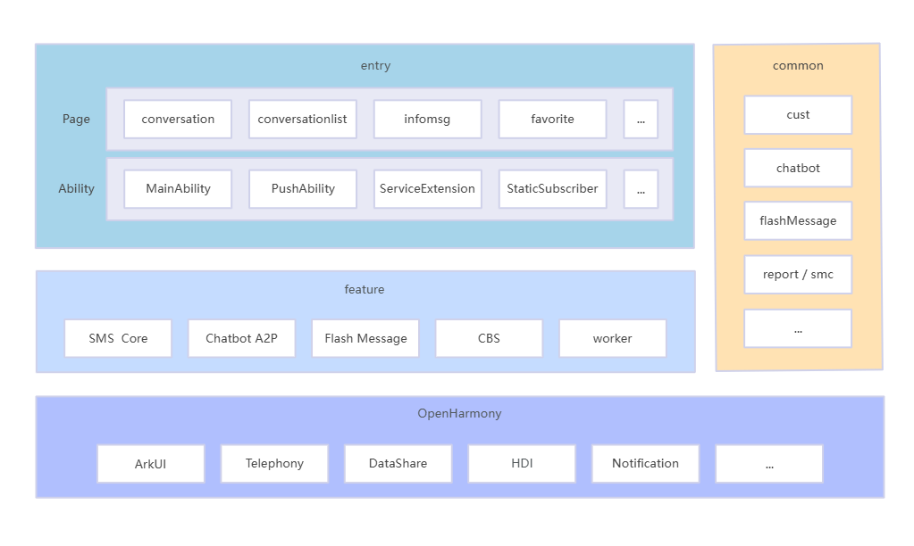

# Messages<a name="EN-US_TOPIC_0000001103554544"></a>
-   [Introduction](#introductiona-nameintroductiona)
    -   [Content Introduction](#content-introductiona-namecontent-introductiona)
    -   [Architecture](#architecturea-namearchitecturea)
-   [Directory Structure](#directory-structurea-namedirectory-structurea)
-   [Repositories Involved](#repositories-involveda-namerepositories-involveda)

## Introduction<a name="Introduction"></a>
### Content Introduction<a name="Content-Introduction"></a>

The Messages App is a pre-installed system application in the OpenHarmony standard system, providing users with basic messaging capabilities. These include support for SMS notifications, message favorites, and Cell Broadcast Service (CBS), SMS conversation details and related operations, message reception, SMS, as well as open-source materials for the SMS application.

**Key Functions:**

1. **SMS Core Functions**: Supporting sending (including long SMS), receiving, forwarding, resending (for failed messages), and deleting (individual or batch) of SMS. It also enables group messaging for both SMS.
2. **Message Notification & Collection**: Displaying message notifications with options to mark as read, reply directly. Users can also collect important messages for easy access later.
3. **Conversation Management**: Providing a user-friendly message list with operations like left-swipe deletion, long-press multi-selection, and slide-to-select. Both the message list and detail pages display contact names and avatars for intuitive identification.
4. **Message Detail Operations**: Supporting multiple actions on message content, including copying text, selecting partial content, forwarding, saving, deleting, and making calls.
5. **Notification Message Handling**: Integrating notification messages into a dedicated list with functions such as marking all as read, deleting individually or in batches via long-press or slide selection.
6. **Supplementary Capabilities**: Including Cell Broadcast Service (CBS) support,  message delivery reports, message ringtones, and restore default settings.

### Architecture<a name="Architecture"></a>


## Directory Structure<a name="Directory-Structure"></a>

```
/applications_mms/
├── AppScope/                                 # Application-level resources and configuration
├── entry
│   ├── src
│   │   ├── main
│   │   │   ├── cust/                         # Customization code
│   │   │   ├── ets/                          # ArkTS business code
│   │   │   │   ├── Application/              # App entry point and lifecycle
│   │   │   │   ├── MainAbility/              # Main Ability entry
│   │   │   │   ├── PrivacyAbility/           # Privacy statement Ability
│   │   │   │   ├── PushAbility/              # Push notification Ability
│   │   │   │   ├── StaticSubscriber/         # Static subscriber (system event listener)
│   │   │   │   ├── ServiceExtension/         # Service extension capabilities (backup/restore/RPC/contact service, etc.)
│   │   │   │   ├── backup/                   # Data backup and restore module
│   │   │   │   ├── chatbot/                  # Chatbot module
│   │   │   │   ├── data/                     # Global data definitions and constants
│   │   │   │   ├── flashMessage/             # Flash Message (desktop popup messages)
│   │   │   │   ├── log/                      # Logging framework
│   │   │   │   ├── model/                    # Data model layer
│   │   │   │   ├── oobe/                     # Out-of-box experience (privacy statement)
│   │   │   │   ├── pages/                    # All pages
│   │   │   │   │   ├── conversation/         # Conversation detail page
│   │   │   │   │   ├── conversationlist/     # Conversation list page
│   │   │   │   │   ├── infomsg/              # Notification message list page
│   │   │   │   │   ├── index/                # App home page
│   │   │   │   │   ├── settings/             # Settings page
│   │   │   │   │   ├── favoritepage/         # Favorite messages page
│   │   │   │   │   ├── groupdetail/          # Group detail page
│   │   │   │   │   ├── groupcontactlist/     # Group member list page
│   │   │   │   │   ├── queryreport/          # Delivery report detail page
│   │   │   │   │   ├── transmitmsg/          # Forward message page
│   │   │   │   │   ├── slidePreview/         # Slideshow preview page
│   │   │   │   │   ├── photoBrowser/         # Photo browser page
│   │   │   │   │   ├── FullImage/            # Full-screen image display page
│   │   │   │   │   ├── managesim/            # SIM card management page
│   │   │   │   │   ├── privacy/              # Privacy statement page
│   │   │   │   │   ├── copy/                 # Copy content display page
│   │   │   │   │   ├── lowMemoryCamera/      # Low memory mode camera page
│   │   │   │   │   ├── mmsurigrant/          # Message grant page
│   │   │   │   │   ├── DeskDialog/           # Desktop popup dialog
│   │   │   │   ├── report/                   # Spam message reporting module
│   │   │   │   ├── service/                  # Business service layer
│   │   │   │   ├── utils/                    # Utility library
│   │   │   │   └── views/                    # Custom UI components
│   │   │   │       ├── AttachmentArea/       # Attachment area components
│   │   │   │       ├── MmsMap/               # Map location components
│   │   │   │       ├── MmsAvatar/            # avatar components
│   │   │   │       ├── MmsReceive/           # Message receive handling
│   │   │   │       └── receive/              # Message receive display components
│   │   │   └── ohosTest/                     # Test code
│   │   └── ohosTest/
│   ├── build-profile.json5                   # Build configuration
│   ├── hvigorfile.ts                         # Build script
│   └── oh-package.json5                      # Package dependency configuration
├── .gitignore
├── LICENSE
├── OAT.xml                                   # Compatibility test configuration
├── README-zh.md                              # Chinese documentation
├── README.md                                 # English documentation
├── build-profile.json5                       # Project-level build configuration
└── build.sh                                  # Build script
```

## Repositories Involved<a name="Repositories-Involved"></a>

[**applications_contacts**](https://gitcode.com/openharmony/applications_contacts)

[**telephony_telephony_data**](https://gitcode.com/openharmony/telephony_telephony_data)
