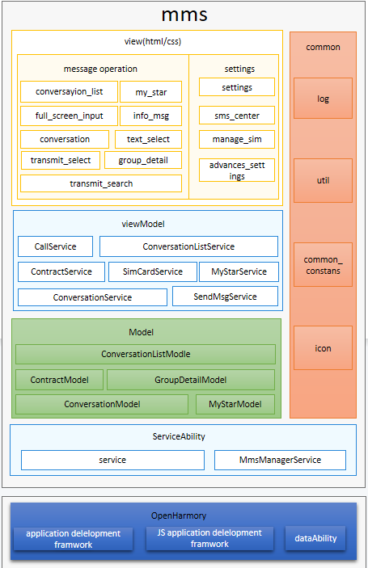

# 短彩信<a name="ZH-CN_TOPIC_0000001103421572"></a>

-   [简介](#section11660541593)
    -   [架构图](#section48896451454)

-   [目录](#section161941989596)
-   [使用说明](#section123459000)
-   [相关仓](#section1371113476307)

## 简介<a name="section11660541593"></a>

短彩信应用是OpenHarmony中预置的系统应用，主要的功能包含发送短信、接收短信、转发、收藏、锁定、重新发送等功能；


### 架构图<a name="section48896451454"></a>



## 目录<a name="section161941989596"></a>

```
/applications/standard/mms
├── figures                             		# 架构图目录
├── entry                               		# 主entry模块目录
│    ├── src		
│      ├── main		
│        └── js                         		# js代码目录
│          └── default		
│            └── common.icon            		# 图标
│              └── i18n                 		# 国际化
│			   └── model                		# 数据管理层
│			   └── pages                		# 页面
│                └── advanced_settings  		# 高级设置页面
│                └── component          		# 组件
│				 └── conversation       		# 信息列表页面
│				 └── conversation_list  		# 会话列表页面
│				 └── full_screen_input  		# 全屏发送页面
│				 └── full_srceen_show_picture  	# 全屏展示图片页面
│				 └── group_detail              	# 群发组详情页面
│				 └── info_msg                  	# 通知信息会话列表页面
│				 └── index                     	# 首页
│				 └── manage_sim                	# sim卡管理页面
│				 └── my_star                   	# 收藏页面
│				 └── query_report               # 查看报告
│				 └── settings                  	# 设置页面
│                └── sms_center 	           	# 短信中心页面
│				 └── text_select               	# 文本选中页面
│				 └── transmit_select           	# 转发页面
│				 └── transmit_search           	# 转发搜索页面		 
│			   └── service             			# 业务逻辑
│			   └── utils               			# 工具类
│        └── resources                 			# 资源存放目录
│        └── config.json               			# 全局配置文件
├── gradle                             			# gradle
│    ├──wrapper            			
├── KeyStore                           			# 许可文件
```

## 使用说明 <a name="section123459000"></a>

   参见使用说明（[使用说明](./doc/Instructions.md)）

## 相关仓<a name="section1371113476307"></a>

系统应用

**applications_standard_mms**

